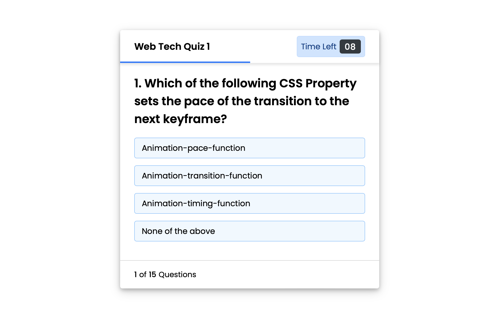
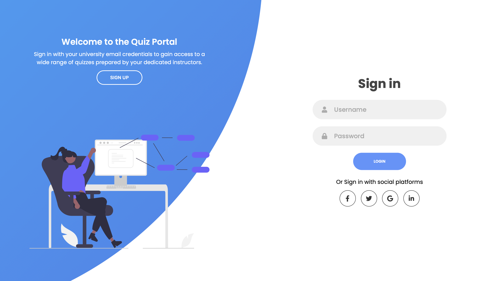

# Quiz Practice Web App

A quiz-based web application built using HTML, CSS, and JavaScript, designed to help practice MCQ-based questions while implementing core front-end concepts such as DOM manipulation, event handling, timer logic, and user interaction.

This project was created as a personal learning exercise to strengthen JavaScript fundamentals and front-end UI structuring.

---

## Features

- MCQ-based quiz system
- Timer-based questions
- Score and progress tracking
- Sign In / Sign Up user interface
- Category-based quiz sections
- Clean and responsive UI layout

---

## Tech Stack

- HTML
- CSS
- JavaScript

---

## Screenshots

### Quiz Interface

---

### Sign Up Page

---

### Sign In Page

---

### Categories / Dashboard

---

### Continue Quiz View

---

### Footer Section

---

## About

This project focuses on practicing front-end development concepts, including:
- DOM manipulation
- Event handling
- UI flow and layout structuring
- Basic quiz logic and state handling

It is intended purely for learning and practice purposes and is not a production-ready application.

---

## Note

This project was developed for educational purposes only.
